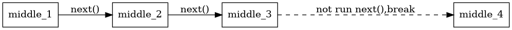

# koa-route-ex

## 框架




## 设计原则

KISS 原则

## 使用 

 - RouteIns 实例
  - register 注册中间件函数到实例上
  - create 创建路由


### 中间件函数的创建
```javascript
//中间件函数: 修改ctx,执行下一个中间件
async function foo(ctx,next){
    ctx.number = 1
    await next();
}
//中间件函数: 不执行下一个中间件,到这个中间件函数就停止
async function bar(ctx,next){
  console.log(ctx.number)
}
// 带一个额外的参数
async function foo_with_argument(ctx,argument,next){
  ctx.number = argument
  await next()
}
```

### 创建routeIns

```javascript
const routeIns = require('route-koa-ex')
const RouteIns = new routeIns()
```

### register的使用

```javascript

//注册foo 中间件函数,默认namespace 为std
RouteIns.register(foo)
//注册多个 中间件函数,默认namespace 为std
RouteIns.register([foo,bar])
//注册foo 中间件函数,namespace 为my_namespace
RouteIns.register(foo,'my_namespace')
```

### 创建路由

```javascript

let i_need_middles = [
    "foo",
    "my_namespace.foo",
    {
      name:"foo_with_argument",
      argument:100,
      namespace:"std" //默认std
    }
]
// 参数1: 路径,需要匹配ctx.path
// 参数2: 需要的中间件描述
var route1 = RouteIns.create('/',i_need_middles)
```

## 路由执行

```javascript
var ctx ={
    method:'GET',
    path:'/'
}
await route1()(ctx,function next(){
    //do noting
})
```


## 实例

参看 [test](./test) 目录

